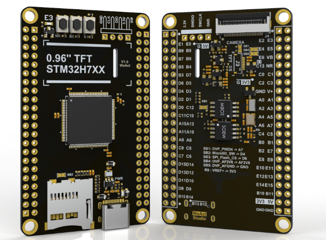

# STM32H7XX

There are different cheap but powerful Chinese development boards with different __STM32H7__ chips.

- STM32H750VBT6 - 128K flash
- STM32H743VIT6 - 2048K flash

I recommend to use the STM32H743VIT6 with 2MB of flash memory. Please note that this is still only half of what you get with an ESP32 but you get an SD drive and 8MB SPI/QSPI Flash!  

The STM32H7XX processors are based on the 32-bit Arm Cortex®-M7 core, running at up to 600 MHz. They have plenty of RAM and Flash Memory and have a FPU for fast double-precision floating calculations. In addition you also have plenty of pins (> 88) available!

I am not a big fan of the __STM Cube IDE__ and find the approach of using generated code a bit "retro". Fortunately we can use __Arduino__.  Because this not well documented, I am taking the oppurtunity to demonstrate how to use them with Arduino:

### DevEBox

 

- [Pin Information](docs/DevEBox/Pins.md)
- [Hardware information](docs/DevEBox/README.md)
- [Techical Drawing](docs/DevEBox/STM32H7XX_M_schematics.pdf)

### WeAct

- [Pin Information](docs/WeAct/Pins.md)
- [Hardware information](docs/WeAct/README.md)
- [Technical Drawing](https://github.com/WeActStudio/MiniSTM32H7xx/blob/master/HDK/STM32H7xx%20SchDoc%20V11.pdf)

### Software Requirements

- Install [Arduino](https://support.arduino.cc/hc/en-us/articles/360019833020-Download-and-install-Arduino-IDE) (if not already done)
- Install the [STMDuino Arduno Core](https://github.com/stm32duino)
- Install the [STMCubeProgrammer](https://www.st.com/en/development-tools/stm32cubeprog.html): This is needed to upload the compiled sketch

### Example Sketches

- [Common Arduino example sketches](examples/Common) Flash, qspi, SD...
- [WeAct specific example Arduino sketches](examples/WeAct) LED, buttons
- [Board specific example Arduino sketches](examples/DevEBox) LED, buttons

- [FreeRTOS](https://github.com/stm32duino/STM32FreeRTOS/tree/main/examples)

### Compile and Upload

#### Using USB Cable

You can upload your sketch w/o any additional programmer:

- Connect the microcontroller with your computer via the USB cable
- Set the microcontroller into ISP mode: e.g. by connecting the BTO with the 3.3V pin
- In Arduino
    - Select the Board "Generic STMH7 Series"
    - in -> Tools -> Board Part Number select your board: e.g. DevEBox...
    - in -> Tools -> Upload Method: Select DFU. This will use the USB cable
    - in -> Tools -> USB Support - CDC generic supercedes Usart
    - in -> Tools -> Usart Support - Enabled (generic serial)

With the help of these settings you will be able the to see the output of Serial.println() in the Arduino Serial Monitor.

You are ready now to compile and upload the sketch the regular way.
Remove the connection between BTO and 3.3V and reboot.

#### Using a ST-Link Programmer

I recommend to use a [ST-Link Programmer](https://www.aliexpress.com/item/1005005273159580.html?spm=a2g0o.productlist.main.3.55421417bcZVae): This allows you debug your code and you do not need to bother with the ISP mode, because this is handled automatically.

- Connect the GND, 3.3V, DIO and CLK pins from the board with the corresponging pins on the programmer
- In Arduino
    - Select the Board "Generic STMH7 Series"
    - in -> Tools -> Board Part Number select your board: e.g. DevEBox...
    - in -> Tools -> Upload Method: Select SWD
    - in -> Tools -> USB Support - CDC generic supercedes Usart
    - in -> Tools -> Usart Support - Enabled (generic serial)

You are now ready to compile and upload the sketch the regular way.
Please note that you still need the USB connection to see the Serial output!

## Futher Information

- [STM32H750VB on st.com](https://www.st.com/en/microcontrollers-microprocessors/stm32h750vb.html)
- [STM32H750VBTx Pins](https://github.com/STMicroelectronics/STM32_open_pin_data/blob/master/mcu/STM32H750VBTx.xml)
- [STM32H743VI on st.com](https://www.st.com/en/microcontrollers-microprocessors/stm32h743vi.html)
- [STM32H743VIT6 Pins](https://github.com/STMicroelectronics/STM32_open_pin_data/blob/master/mcu/STM32H743VITx.xml)
- [STM32H7XX_M schematics](https://github.com/mcauser/MCUDEV_DEVEBOX_H7XX_M/blob/master/docs/STM32H7XX_M_schematics.pdf)
- [External Loader](https://controllerstech.com/w25q-flash-series-part-10-qspi-ext-loader-in-h750/)

## License

Licensed under the [MIT License](http://opensource.org/licenses/MIT).
