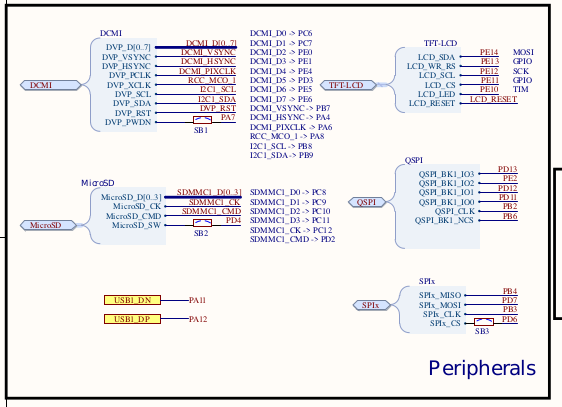

# WeAct Pins


## Buttons & LED

#### Buttons 

- NR - NRST
- Boot - BOOT0
- K1: PC13 


#### User LED 

- PE3 - Blue LED


## Peripherals



#### Micro SD (U5)

- PC10 D2
- PC11 D3
- PD2 CMD
- PC12 SCK
- PC8 D0
- PC9 D1

```C++
  // setup SD Pins for DevEBox MCU
  card.setDx(PC8, PC9, PC10, PC11);
  card.setCMD(PD2); // using PinName
  card.setCK(PC12);
```

The Micro SD has no CS Pin, so we can not share the SPI port!
In Arduino we can use the SD API in 1 bit mode using SPI, so we need to define the relevant pins in SPI:

```C++
  SPI.setMISO(PC8);
  SPI.setMOSI(PD2);
  SPI.setSCLK(PC12);
```

#### QSPI Flash W25Q64 (U3)

- PB6 CS
- PD12 DO (IO01)
- PE2 WP (IO02)
- PD11 HOLD (IO03)
- PB2 CLK
- PD13 DI (O3)
- VCC 3V3

The HOLD pin must be set high and Write Protect (WP) set to low to enable writes.
In Arduino we can use the SPI API in 1 bit mode, so we need to define the relevant pins in SPI:

```C++
  SPI.setMISO(PD13);
  SPI.setMOSI(PD12);
  SPI.setSCLK(PB2);

  //The CS pin needs to be set to PB6
  Flash.begin(SPI, PB6);

```
